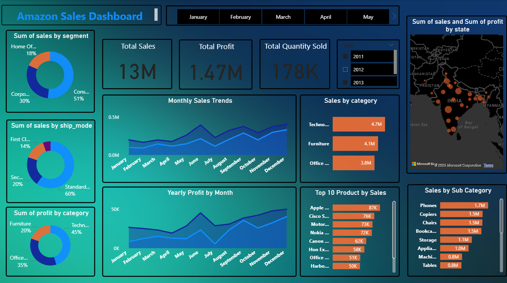

# 📊 Amazon Superstore Sales Dashboard (2011–2014)

I developed this interactive and data-rich Power BI dashboard project to analyze **Amazon Superstore sales data** over a 4-year period (2011–2014). The objective was to derive meaningful insights into sales performance, customer behavior, and product trends, and to present these findings through an interactive, clean, and business-ready dashboard.

This project replicates a **real-world Business Intelligence workflow**, starting from data cleaning in Excel, defining and calculating KPIs, modeling data in Power BI, and finally building an insightful, executive-level dashboard using **DAX** and **data storytelling techniques**.

---

## 🎯 Project Goals

- Understand key **sales drivers** and **profit trends**
- Analyze performance across **regions**, **states**, and **customer segments**
- Track **product category** performance and **shipping efficiency**
- Build an intuitive dashboard with **interactive filters**, **visual summaries**, and **drill-downs**
- Showcase **Power BI & Excel integration**, including DAX-based KPIs

---

## 🖼️ Dashboard Preview

### 💡 Dashboard Highlights

- 📌 KPI Cards: Total Sales, Profit, Quantity Sold
- 🧭 Sales breakdown by Segment and Ship Mode
- 🗺️ Profit & Sales map by State (India-focused)
- 📆 Monthly & Yearly Trends (line & bar charts)
- 🛍️ Top Products, Sub-Categories, and Categories
- 🔄 Interactive Slicers for dynamic filtering
- 📊 Visual balance between summary and detail

---

## 📊 Key Business Insights

- The **Consumer segment** drives over **half of the total sales**
- **Technology** is the top-performing category in both sales and profit
- **Standard Class** shipping dominates, accounting for ~60% of all orders
- Highest sales and profit occur during **Q4 (Oct–Dec)** every year
- A small group of products (top 10) accounts for a significant share of sales
- Certain Indian states (like Maharashtra and Karnataka) consistently outperform others

---

## 📁 Project Files

| File Name                          | Description                                           |
|-----------------------------------|-------------------------------------------------------|
| `amazon.pbix`                     | Main Power BI dashboard file                          |
| `cleaned_Super_store_orders_data.xlsx` | Excel file with cleaned, transformed data         |
| `Amazon sales kpi.xlsx`           | Defined KPIs and calculations used in visuals         |
| `Dashboard.png`                   | Screenshot of the final Power BI dashboard            |
| `README.md`                       | Project overview and documentation                    |

---

## 📦 Data Overview

- 📅 **Date Range:** 2011 to 2014
- 🛍️ **Sales, Profit, Quantity, and Discounts**
- 🗂️ **Dimensions:** Region, State, Segment, Category, Sub-Category, Ship Mode
- 📌 **Source:** [cleaned_Super_store_orders_data.xlsx](https://github.com/abhijay191/Amazon-Sales---Analysis/blob/main/cleaned_Super_store_orders_data.xlsx)

---

## 🛠️ Tools & Technologies

| Tool             | Usage                                           |
|------------------|-------------------------------------------------|
| **Microsoft Excel**  | Data cleaning, KPI setup                       |
| **Power BI Desktop** | Data modeling, dashboard design               |
| **DAX (Data Analysis Expressions)** | KPI calculations and dynamic metrics |
| **GitHub**          | Version control and project hosting            |

---

## 🧠 What I Learned

- ✅ End-to-end BI pipeline from raw data to actionable insights
- ✅ Creating reusable and maintainable Power BI models
- ✅ Writing optimized and accurate DAX formulas
- ✅ Balancing aesthetic design with functional storytelling
- ✅ Preparing real-world projects for professional portfolios

---

## 💼 Portfolio Relevance

This project demonstrates core skills every Data Analyst or BI Developer needs:

- 📊 Strong analytical thinking
- 🧩 Data modeling and transformations
- 📈 Business-centric visual storytelling
- 📎 Tool integration (Excel + Power BI)
- 🛠️ Project documentation for versioning and collaboration

---

## 📫 Connect with Me

- **GitHub:** [abhijay191](https://github.com/abhijay191)
- **LinkedIn:** https://www.linkedin.com/in/abhijay-singh-971801198/
- **Email:** abhijaysingh.as@gmail.com

---

